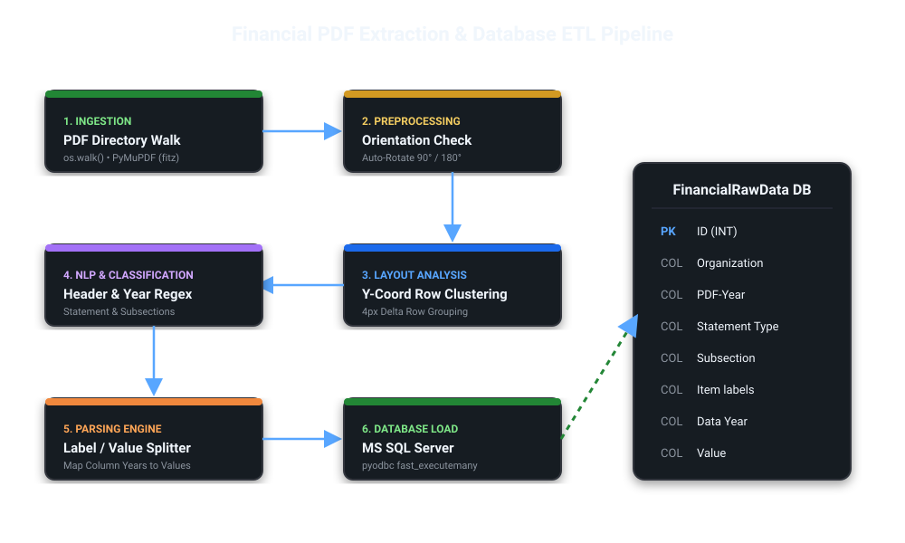

# Financial PDF Extraction & Database ETL Pipeline

An end-to-end Python ETL pipeline that extracts structured financial metrics, statement subsections and historical rows from semi-structured corporate PDFs and loads them into an MS SQL Server warehouse.

---

## 🗺️ Pipeline Architecture Flow & Database Schema

Below is architectural layout of the data extraction layers:

---

## 🛠️ Operational Stack Details
1. **Ingestion**: Scans resource folders recursively using Python's `os.walk()` framework.
2. **Preprocessing**: Validates page geometries and handles structural rotation corrections.
3. **Layout Analysis**: Clusters broken text blocks using a strict 4px horizontal baseline filter.
4. **Classification**: Parses target tables with specialized Regular Expressions.
5. **Database Target**: Microsoft SQL Server Staging Database utilizing `pyodbc` streaming optimizations.

